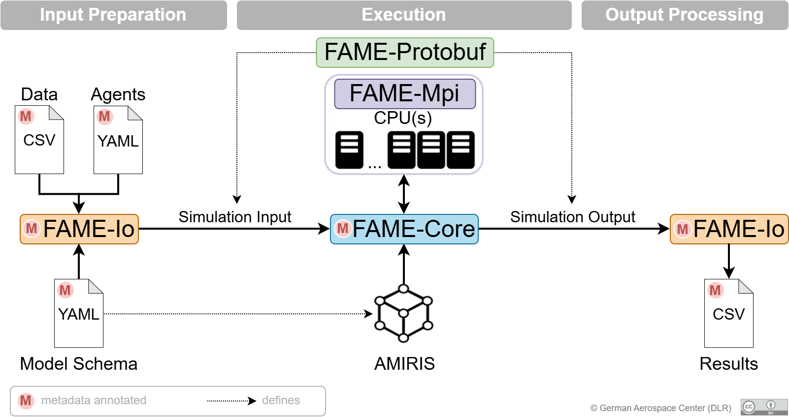

## Scope

AMIRIS is dedicated to the electricity market and its actors.
It focuses on the behaviour of these actors with respect to the electricity market.
Related aspects, e.g., fuel market dynamics, are not explicitly modelled but simplified.
If more detail is required for these aspects, a model coupling with model(s) that cover the other aspect in more detail is suggested.

## User groups

### Model users

Model users require a basic understanding of how FAME applications are parameterised and executed using FAME-Io.
They also need to understand the concepts of each (used) component in AMIRIS, the actions these can take, and when those should be executed.
It is our goal that the required knowledge can be obtained from the model documentation and provided examples.

### Model Developers

In addition to the skills of model users, model developers have at least a basic understanding of FAME-Core.
They also bring understanding of the technicalities of the component they model, its strategies, restrictions, market impacts, and interactions with other model components.

## Technical context

| Neighbour     | Description                                                                                                                |
|---------------|----------------------------------------------------------------------------------------------------------------------------|
| FAME-Core     | Provides base classes for Agents and Abilities, as well as Annotations for Inputs, Outputs, and Products                   |
| FAME-Io       | Prepares binary input file for AMIRIS using the schema, configuration, and data; extracts the created binary result file   |
| FAME-Protobuf | Defines binary file formats for simulation input and output                                                                |
| FAME-Mpi      | Coordinates distribution of information between multiple processes                                                         |
| Schema        | Defines Agent inputs, Outputs, and Products                                                                                |
| User          | Provides simulation configurations and associated data                                                                     |
