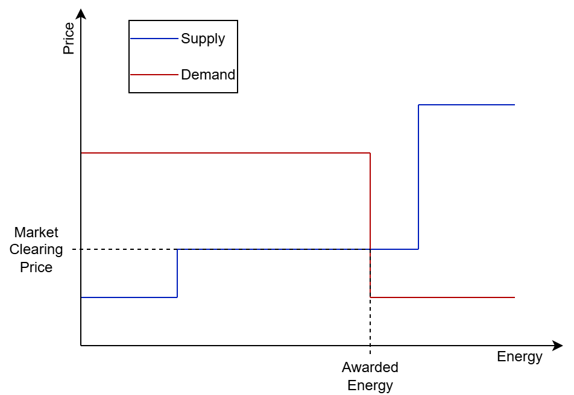
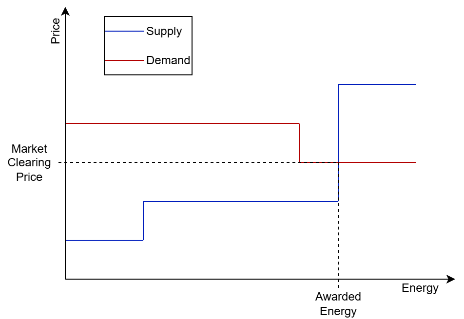
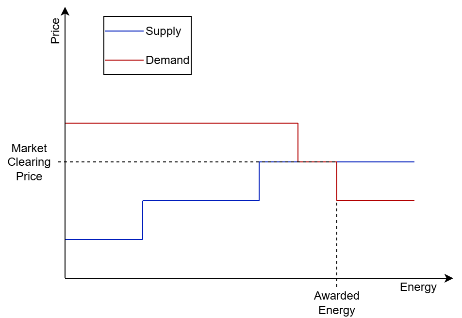
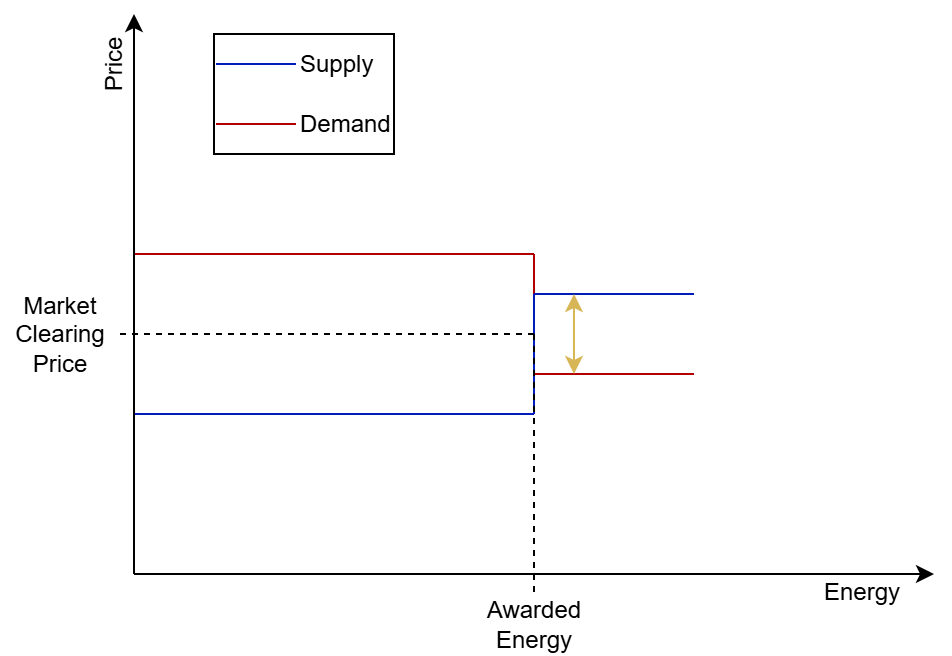
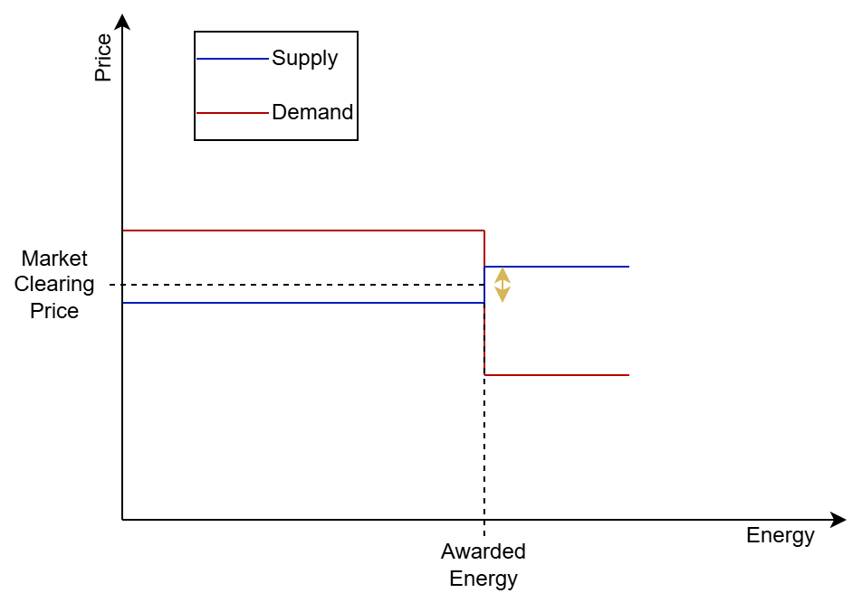
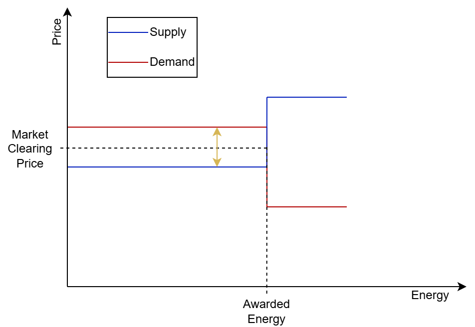
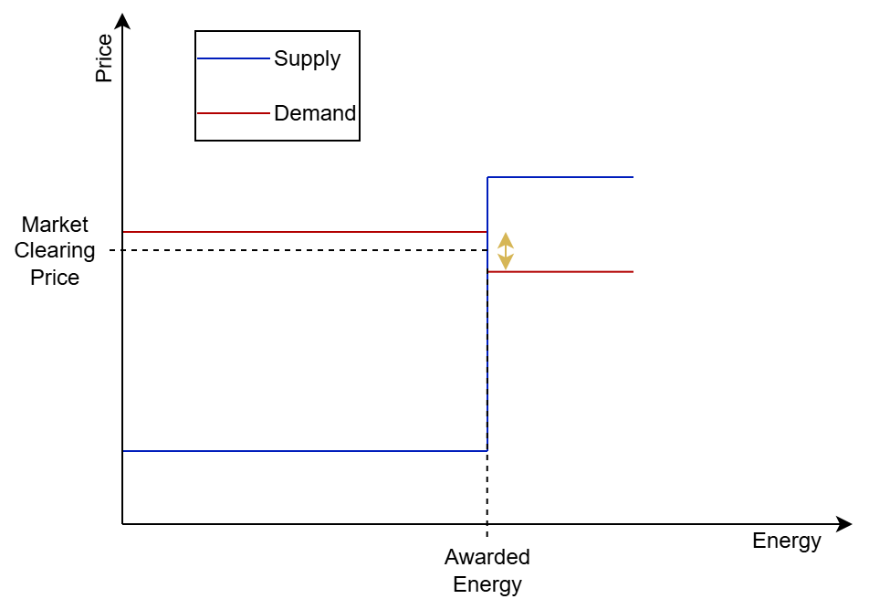

# Short Description

Performs merit-order market clearing based on given [SupplyOrderBook](./SupplyOrderBook.md) and [DemandOrderBook](./DemandOrderBook.md).
Those should contain all Bids and Asks for the same time period in question.

# Details

The function takes two sorted OrderBooks for demand (descending by offerPrice) and supply (ascending by offerPrice).
The OrderBooks are also sorted ascending by cumulatedPower.
It is assumed that the price of the first element from demand exceeds that of the first supply element.
Additionally, the OrderBooks need to contain a final bid reaching towards positive / negative infinity for supply / demand to ensure the cut of the curves.
In addition, both demand and supply totals must have a positive energy value.
Sorting and bid structure is enforced in the OrderBook class.
The algorithm begins with the lowermost element from demand and supply.
It compares the demand and supply price from these elements.
In case the demand price is lower than the supply price, the condition for a cut of the discrete functions is met.
If no cut is found, the next element from demand and/or supply is selected, whichever has the lower cumulatedPower.
Then the cut condition is evaluated again.

## Determination of Market Clearing Price and Awarded Energy

The market clearing price and awarded energy depends on **how** the bid curves for demand and supply cut each other.
The following cases may occur:

### Demand Cuts Supply

### Supply Cuts Demand

### Cut With Price Overlap

In the edge case of a cut with (partial) overlap at the same price, AMIRIS assigns the upper limit of power.

### Cut With Energy Overlap

In the edge case of a cut with (partial) overlap at the same energy the market clearing price is determined as average of

1. the maximum price of the awarded supply bid and the non-awarded demand bid and
2. the minimum price of the awarded demand bid and the non-awarded supply bid.

Thus, the following for sub-cases occur:

#### Case One

The market clearing price is determined as average of the first non-awarded bid of supply and demand.

#### Case Two

The market clearing price is determined as average of the last awarded and first non-awarded supply bid.

#### Case Three

The market clearing price is determined as average of the last awarded bid of supply and demand.

#### Case Four

The market clearing price is determined as average of the last awarded and first non-awarded demand bid.

# See also
* [MarketClearingResult](./MarketClearingResult.md)
* [DemandOrderBook](./DemandOrderBook.md) 
* [SupplyOrderBook](./SupplyOrderBook.md)