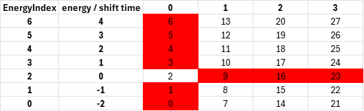
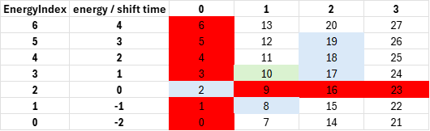
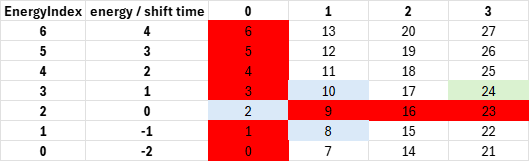

# In short

`StateDiscretiser` handles discretisation of states of a [GenericDevice](./GenericDevice.md) with respect to the device's energy (state of charge), and time out of balance (shift time).

# Details

## Assumptions

The same assumptions apply as for [StateManager](./StateManager.md).

## Basic approach

As described for the `StateManager`, the discrete steps are fixed within a given planning horizon.
The `StateDiscretiser` can discretise states along two dimensions:
* energy: energy states denote the state of charge of a `GenericDevice`
* time out of balance: time states denote, for how long an energy device is out of balance. 

Time out of balance is only applicable in case, intertemporal constraints apply, e.g. for load shifting.
Otherwise, there is only one time state, i.e., we end up with a one-dimensional energy state representation, see [EnergyStateManager](./EnergyStateManager.md)

## Energy and time discretisation

A simplistic example is used to explain state and time discretisation and its application for modelling load shifting.
First, we consider the [state initialisation](#state-initialisation), where all states that exist in principle are created. 
Afterwards, we look at a [standard transition](#standard-transitions), where power bounds can apply and limit the reachable states.
At the end, we consider the possibility to [prolong shifts](#prolonged-shifts), which is only valid for a portfolio of multiple load shifting units.
Prolonging can be enabled or disabled, depending on the scope of modelling, see [GenericDevice](./GenericDevice.md).

### State initialisation

The figure below contains an example with a maximum shift time of 3 and energy states between -2 and 4.
States that do not exist are marked in red:
* For a shift time of zero, no shift is active. Thus, the energy content must equal to 0 as the energy balance is levelled out.
* Similarly, for shift times other than zero, no states with an energy content of 0 can exist.
  This would mean that the energy balance is levelled out which can be translated to resetting the shift time to zero.
* All other states can in principle be reached without accounting for power bounds.
  Such power bounds may cause that, additionally, some states cannot be reached within a transition.
  We'll get back to this later in the prevalent example.

_Visualisation of all feasible energy-time-states and their state index _

All states are attributed with a unique ID.
This ID starts with zero and increases with each energy state and shift time.

### Standard transitions

Let's assume, we consider a [GenericDevice](./GenericDevice.md) with the following specifications at a given time `t`:
* Minimum energy content: -20 MWh
* Maximum energy content: 40 MWh
* Energy resolution: 10 MWh
* Maximum shift time: 3 h
* Maximum upshift power: 20 MW
* Maximum downshift power: 20 MW

using an hourly time resolution, these specifications lead to a state representation that is in line with our example above.

Now let's further assume, we are at the state with the ID 10 at time.
This translates into a situation where we have shifted 10 MW for one hour, resulting in an energy content of 10 MWh.
The starting state is marked light green in the figure below.
Potential follow-up states that can be reached from the starting state are marked in light blue.
Again, states that do not exist are marked in red.

_Visualisation of feasible follow-up states for given starting state in a standard transition_

From this starting point, the following follow-up state indices can be reached:
* ID 17: No additional energy is shifted, thus the energy content stays the same. The shift time, however, increases by one as we haven't balanced out.
* ID 18: We shift additional 10 MWh into the same direction as in the previous hour. The energy content is increased to 20 MWh. The shift time increases by one.
* ID 19: We shift additional 20 MWh into the same direction as in the previous hour. The energy content is increased to 30 MWh. 
  The shift time increases by one.
  We make full use of our upshift power limit of 20 MWh/h.
  Thus, we cannot reach the state with ID 20 as this would violate our upshift power bound.
* ID 2: We balance our shift by shifting 10 MWh in downwards direction.
  We reach an energy content of 0 and the shift time is reset to 0.
* ID 8: We balance our shift by shifting 10 MWh in downwards direction.
  Additionally, we shift another 10 MWh downwards and start with a counter shift, i.e. an initial downshift.
  The energy content is -10 MWh and the shift time is re-initialised with one.
  We make full of our downshift power limit of 20 MWh/h.
  Thus, we cannot reach the state with ID 7 as this would violate our downshift power bound.

*Note*: We cannot reach any state which has a shift time of 3 as the shift time is either increased by one or reset to 0 (in case of compensation) or 1 (in case of a counter shift).

### Prolonged shifts

Now let's assume, we have the same [GenericDevice](./GenericDevice.md), but now are in the state with the ID 24 at time `t`.

This translates into a situation where we have shifted 10 MW for one hour, resulting in an energy content of 10 MWh.
In contrast to the situation above, we retained that energy content for three consecutive hours.
Therefore, we have a current shift time of 3 hours.
This is visualised in the figure below.
Again, the starting state is marked in light green, follow-up states for the transition that can be reached from the starting state are marked in light blue, and states that do not exist are marked in red.

_Visualisation of feasible follow-up states for given starting state in a transition phase where prolonging is an option_

If we did not allow for prolonging, from this starting state, the following follow-up state indices can be reached:
* ID 2: We balance our shift by shifting 10 MWh in downwards direction.
  We reach an energy content 0 and the shift time is reset to 0.
* ID 8: We balance our shift by shifting 10 MWh in downwards direction.
  Additionally, we shift another 10 MWh downwards and start with a counter shift, i.e. an initial downshift.
  The energy content is -10 MWh and the shift time is re-initialised with one.
  We make full of our downshift power limit of 20 MWh/h.
  Thus, we cannot reach the state with ID 7 as this would violate our downshift power bound. 

The shift cannot be continued as this would cause a violation of the maximum shift time.
However, if we do allow for prolonging, we can reach the following additional state:
* ID 10: We balance the ongoing shift by shifting 10 MWh of our portfolio downwards. At the same time, we shift another
  10 MWh upwards to start a new shift.
  Judging from the energy content, this is the same as a continuation of the previous shift.
  Thus, we refer to it as prolonging.
  We remain at an energy content of 10 MWh.
  The shift time, however, is re-initialised with 1 as parts of the portfolio are starting a new shift event.
  The state with ID 11 cannot be reached as this would violate power bounds.
  This is because we use 50% of our downshift power to compensate for the ongoing upshift.
  We interpret this as 50% of the load shifting portfolio being active.
  Hence, we end up with another 50% of the portfolio that can be used for an upshift and also 50% of our available upshift power of 20 MWh/h, i.e. 10 MWh/h.

*Note*: Prolonging is only an option for a load shifting portfolio, where parts of the load shifting portfolio can be operated independent of each other.

## Operations

Before `StateDiscretiser` can be used, its method `setBoundaries()` must be called to defined which boundaries apply in the energy and time dimension.
Furthermore, if time constraints and prolonging apply, `setShiftEnergyDeltaLimits()` should be called to declare power limits of transitions.

Then, `getAllAvailableStates()` returns indices for all technically possible states ignoring impossible states.
Its method `discretiseEnergyDelta()` returns number of discretisation steps equivalent to given energy delta.
`StateDiscretiser` can translate from energy indices (considering only the energy dimension) and state indices (also considering the time dimension) to corresponding energy level using `energyIndexToEnergyInMWH()` and `getEnergyOfStateInMWH()`, respectively.
`getEnergyIndexDelta()` projects a state-index delta onto a pure energy-index delta.
Call `getFollowUpStates()` to obtain a list of all potential follow-up states than can be reached applying provided energy deltas, and considering prolonging (if activated).
Use `isProlonged()` to check whether a state transition corresponds to a prolonging action.
`energyToNearestEnergyIndex()` rounds a given energy content to the closest discretised energy level index, whereas `roundToNearestShiftTimeIndex()` rounds a given time to the closest shift time level index.
Use `getStateIndex()` to obtain the state index from energy-level index and shift-time index.
`calcEnergyDeltaInMWH()` returns the energy delta between two provided states identified by state index.
`calcShiftTimeIndexFromStateIndex` extracts the shift-time index from the provided state index.
Use `getStateCount()` to obtain the total number of states **including** technically invalid states.

# Input from file

* `energyResolutionInMWH`: defines the energy delta between two consecutive levels in the energy dimension
* `timeResolution`: defines the time delta between two consecutive levels in the time dimension
* `allowProlonging`: declare whether prolonging is shall be considered

# See also

* [StateManager](./StateManager.md)
* [EnergyStateManager](./EnergyStateManager.md)
* [GenericDevice](./GenericDevice.md)