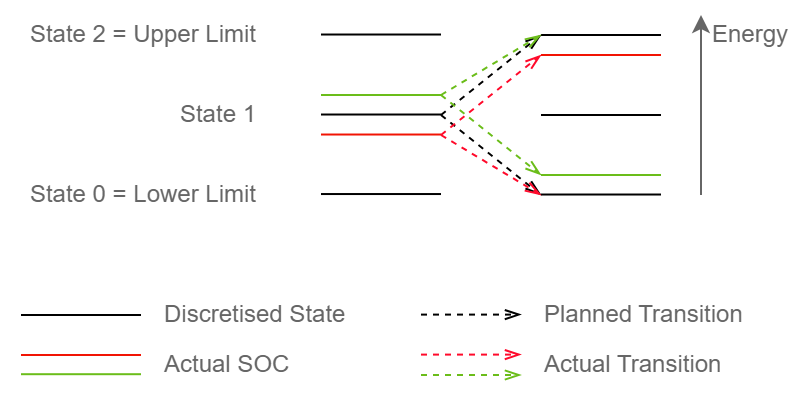

# In short

`StateEvaluations` holds evaluations of states as they occur in dynamic programming. 
Based on these evaluations `StateEvaluations` can create dispatch schedules.

# Details

## Dispatch scheduling

When creating a dispatch schedule, `StateEvaluations` consider the actual state of charge (SOC) of the associated `GenericDevice`.
However, the actual SOC might not exactly match a discretised energy state used during the optimisation.
Therefore, `StateEvaluations` will base its schedule using the discretised energy state closest to the actual SOC.
It will perform "parallel shifts" and use the same transition pathway as originally planned.
However, if a transition would exceed the energy limits of the `GenericDevice`, this transition will be adjusted to respect these limits.
This, however, only applies if the initial state is already out of bounds.
In contrast, if no valid state can be identified during planning due to excessive inflows or outflows, `StateEvaluations` will throw an Exception.
This can be avoided if excessive inflows or outflows are CUT in the associated [GenericDevice](./GenericDevice.md).

Correction for time states are not needed for the time out of balance or shift time, as only integer values are allowed here
and no deviations may occur.

Illustration of parallel shift transitions (green, red) of the device schedule if the device's SOC does not exactly match a discrete state during planning (black).

# See also

* [StateManager](./StateManager.md)
* [GenericDevice](./GenericDevice.md)