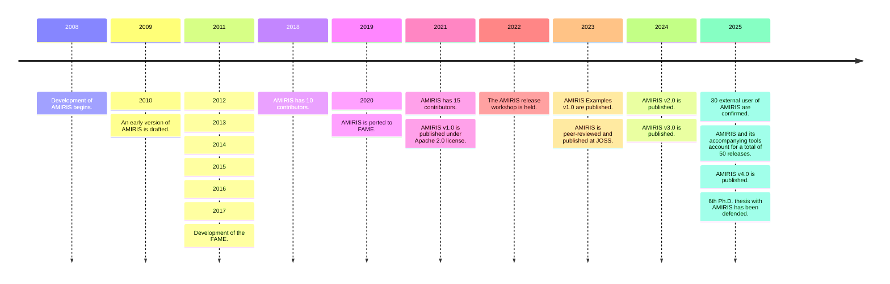

# About AMIRIS

AMIRIS is developed for more than 15 years. 
See a short overview of AMIRIS's history below.

```mermaid
timeline
  accTitle: AMIRIS development history and milestones
  accDescr: Timeline showing the AMIRIS development history and its milestones
 
  2008: Development of AMIRIS begins.
  2009:
  2010: An early version of AMIRIS is drafted.
  2011:
  2012:
  2013:
  2014:
  2015:
  2016:
  2017: Development of the FAME.
  2018: AMIRIS has 10 contributors.
  2019:
  2020: AMIRIS is ported to FAME.
  2021: AMIRIS has 15 contributors.
      : AMIRIS v1.0 is published under Apache 2.0 license.
  2022: The AMIRIS release workshop is held.
  2023: AMIRIS Examples v1.0 are published.
      : AMIRIS is peer-reviewed and published at JOSS.
  2024: AMIRIS v2.0 is published.
      : AMIRIS v3.0 is published.
  2025: 30 external user of AMIRIS are confirmed.
      : AMIRIS and its accompanying tools account for a total of 50 releases.
      : AMIRIS v4.0 is published.
      : 6th Ph.D. thesis with AMIRIS has been defended.  
```