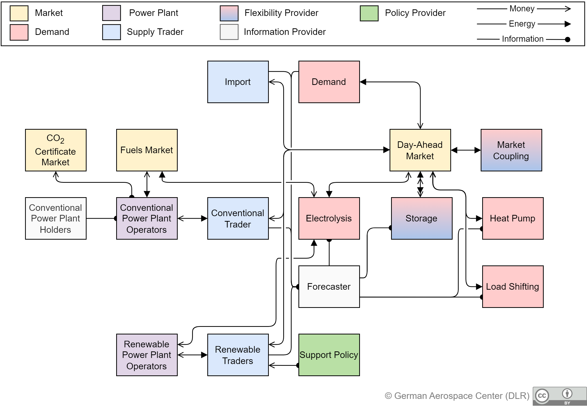

### [Get Started](./Get-Started.md) &ndash; [Model Classes](./Classes.md)  &ndash; [Extensions](./Extensions.md) &ndash; [Glossary](./Glossary.md) &ndash; [Community](./Community.md)

The agent-based electricity market model AMIRIS has evolved for almost twenty years to a next-generation tool, ready to dissect the complex questions arising with respect to future energy markets, their market design and energy related policy instruments.
The model computes electricity prices endogenously based on the simulation of strategic bidding behavior of prototyped market actors.
This bidding behavior does not only reflect marginal prices, but it also considers effects of support instruments like market premia.
Figure 1 provides an overview of the agents modeled in AMIRIS and illustrates the associated information, energy, and financial flows.

The actors represented as agents in AMIRIS can be roughly divided into six classes: Power plant operators, traders, marketplaces, policies, demand, and storage facilities.
Power plant operators provide generation capacities to traders, but do not trade on the markets themselves in the model.
Bidding and operation decisions are conducted by traders in pursuit of e.g. profit maximization strategies.
Marketplaces serve as trading platforms and organize market clearing.
Policies define a regulatory framework, which impacts the decisions of other agents. Demand agents as well as storage facilities trade directly in the electricity market. Simulations with AMIRIS thus enable the investigation of the influence of political framework conditions on the behavior and profitability of energy market actors, taking into account different marketing paths, as well as the quantification of the influence of uncertainties and socioeconomic decision aspects of individual actors on energy markets.

Due to its agent-based and modular nature, AMIRIS can be easily extended or modified, see [Model Classes](Classes) and [Extensions](Extensions).
AMIRIS is based on the open-source framework for distributed agent-based models of energy systems [FAME](https://gitlab.com/fame-framework/wiki/-/wikis/home).
Due to its high-performance computing capability (significantly ensured by parallelization readiness) and computationally efficient development paradigms, AMIRIS can simulate even large-scale agent systems in a short time.
Currently, several model years can be simulated at hourly resolution in less than a minute.
Get started [now](Get-Started)!

## Roadmap

Please have a look at our [Roadmap](./Roadmap.md) to see what plans we have for AMIRIS in the future.

## License

AMIRIS software is licensed under [Apache 2.0](../LICENSES/Apache-2.0.txt).

If not stated otherwise, the content of this wiki is licensed under [CC-BY 4.0](https://creativecommons.org/licenses/by/4.0).

 German Aerospace Center.